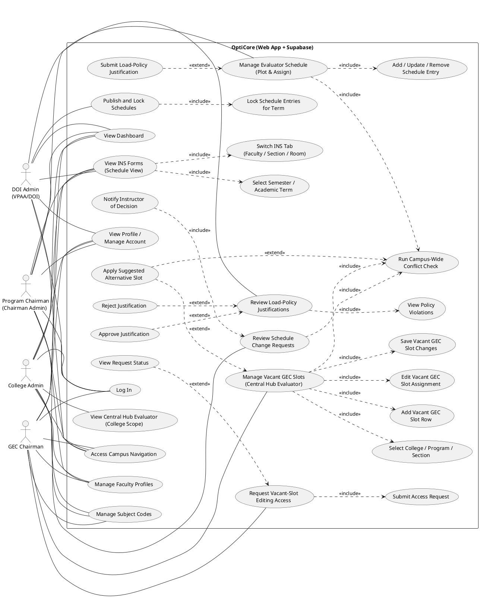
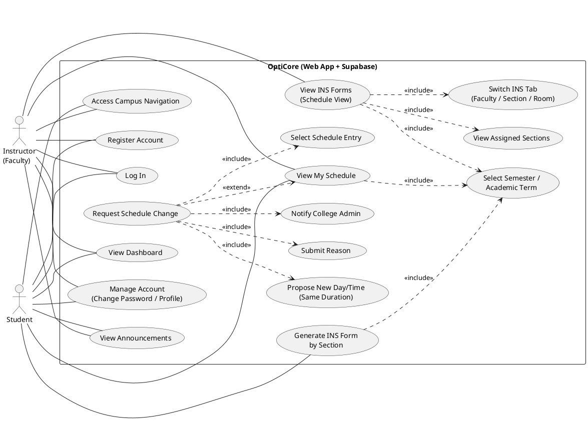
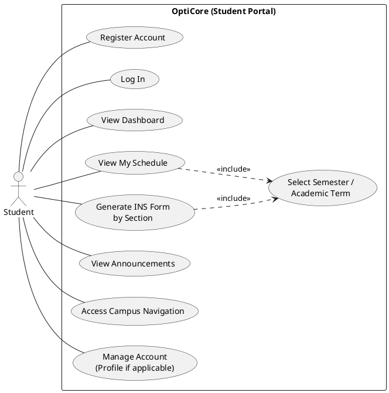
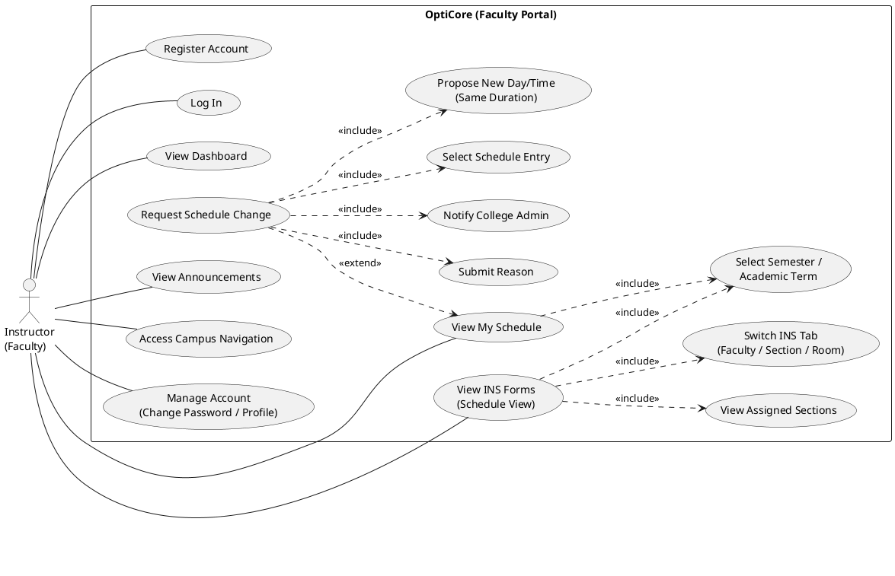
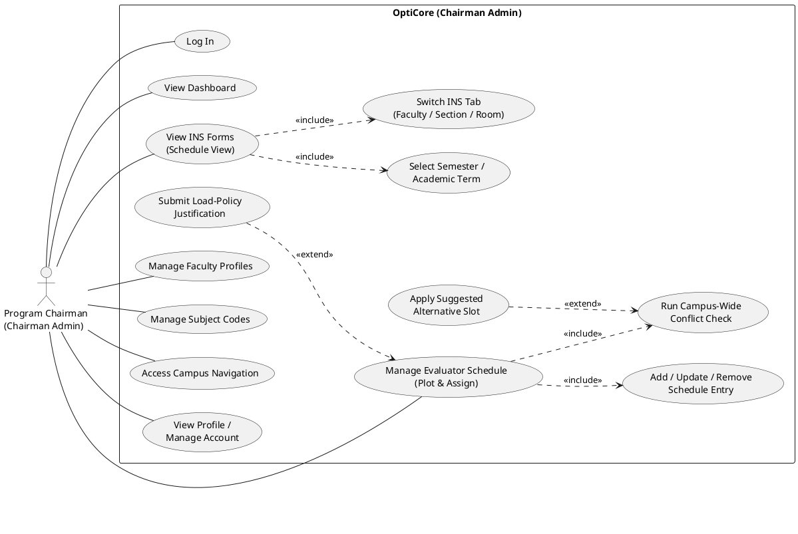
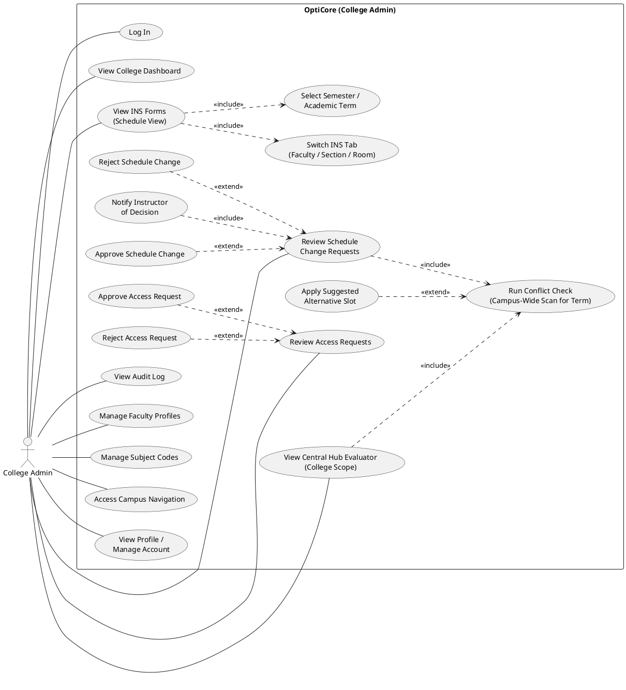
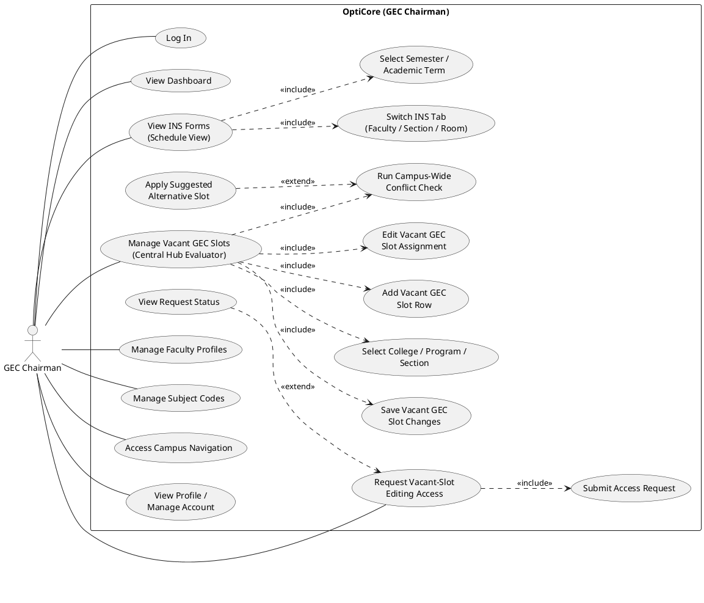
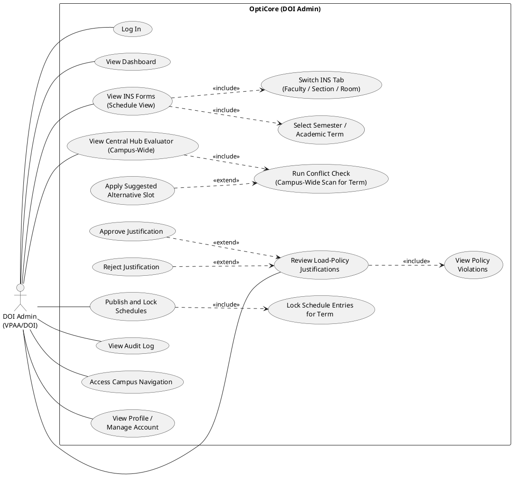

# OptiCore: Campus Intelligence System — CTU Argao  
## Methodology & Methods (Thesis Chapter Draft)

*The research-oriented subsections **3.3–3.5** below retain the thesis’s instruments and data-treatment narrative. **SYSTEM METHODOLOGY** (§4.1–4.10) follows the required deliverable structure: development summary, external interfaces (four sub-types), functional requirements, use cases and GUI figures, data design, architecture, performance, security and **RA 10173**, other non-functional requirements, software stack, and operations/cost. Adapt numbering to the institution’s template.*

---

## 3.3 Research Instruments

The investigation will employ a **fully functional web-based information system** as the primary research artifact. The **OptiCore: Campus Intelligence System** prototype will serve as both the intervention and the instrument through which scheduling workflows, policy visibility, multi-role coordination, and **centralized schedule visibility** will be observed. Data collection instruments will include structured **AuditLog** extracts (governance actions), **surveys**, **semi-structured interviews**, and **observation checklists** aligned with evaluator plotting, inbox forwarding, Central Hub navigation, and **AccessRequest** approvals. The digital platform will constitute a **composite instrument** that generates traceable behavioral data through normal use.

---

## 3.4 Data Gathering Procedure

Data will be gathered in **phases**: baseline encoding of catalogs; **prototype deployment** with persisted `ScheduleEntry`, notifications, workflow messages, justifications, and access requests under **RLS**; **transaction log extraction** with pseudonymization where required; **instrument administration** after at least one full coordination cycle (plot → forward → hub review → access approval as applicable); and **triangulation** of metrics with qualitative themes. Electronic data will reside in **encrypted Supabase** storage with token rotation per IT policy.

---

## 3.5 Statistical Treatment / Treatment of Data

Quantitative indicators will be summarized with **descriptive statistics** and, where appropriate, **non-parametric tests** for small administrative samples. Qualitative transcripts will undergo **thematic analysis**; system logs will **corroborate** self-reports where available. Missing data will be reported transparently.

---

# SYSTEM METHODOLOGY

## Development approach summary

The OptiCore system will be developed as a **web-centric, cloud-backed** application using **Next.js 15** (App Router), **TypeScript**, **Tailwind CSS**, and **Supabase** (PostgreSQL, authentication, Row Level Security, and optional Realtime). Development will follow an **iterative** pattern: reference data and RLS policies will be established in versioned **SQL migrations**; UI shells (**CampusIntelligenceShell** for administrative actors, **PortalShell** for faculty and students) will enforce **role-based** navigation; and scheduling logic will center on a **single persisted `ScheduleEntry` repository** surfaced by the **Chairman Evaluator** (program-scoped authoring) and by the **Central Hub Evaluator** (cross-college reading by college selection). The **Chairman** will **forward** workflow messages to the **College Admin** after plotting; the College Admin will **receive** and may **download** message text for records, while **authoritative schedule state** remains in the database—reducing repeated exchange of attachments. **Approval-gated** scopes (**`AccessRequest`**) will control sensitive edits such as **vacant GEC slots**. This approach aligns implementation with institutional coordination needs while keeping the stack maintainable for academic and pilot deployment contexts.

---

## 4.1 External Interface Requirements

The OptiCore platform will feature **external interfaces** that support user interaction, data exchange, and integration with the **Supabase** backend within the CTU Argao environment. The following subsections describe the **user**, **hardware**, **software**, and **communication** interfaces.

### 4.1.1 User Interface

The **primary user interface** will be **web-based**, implemented with **React** and **Next.js**, and styled with **Tailwind CSS**. It will provide an **interactive and responsive** experience for distinct actors. Design priorities will include **intuitive navigation**, **clear presentation** of schedules and policies, **accessible contrast**, and a **consistent** crimson/orange Campus Intelligence theme for administrators. Key considerations will include:

- **Chairman Admin:** The interface will include modules for **program-scoped** timetable plotting in the **Evaluator**, **conflict detection** with attributable overlaps, **INS Form (schedule views)** with search and filter (including prospectus-oriented filters where implemented), **Inbox** forwarding of INS and Evaluator references to the College Admin, **Faculty Profile** and **Subject Codes** maintenance, and **Campus Intelligence** dashboard summaries.
- **College Admin:** The interface will provide the **Central Hub Evaluator** (college tiles and consolidated read context), **Inbox** (receive and **download** workflow messages), **Access requests** (approve scoped temporary access), **Audit log**, and college-scoped catalog views consistent with RLS.
- **CAS Admin:** The interface will include **Central Hub**, **GEC distribution**, **Inbox**, **Audit log**, and shared administrative modules.
- **GEC Chairman:** The interface will include **Request access**, **Vacant GEC slots** (edit only when an approved **`gec_vacant_slots`** scope exists), **Inbox**, and **Central Hub** read context.
- **DOI Admin:** The interface will include **Central Hub**, **Policy reviews** (load-policy justifications), **Inbox**, **Audit log**, and campus-wide read contexts permitted by policy.
- **Instructor:** The **Portal** interface will support **dashboard**, **my schedule**, **request change**, and **announcements** with a lighter navigation chrome.
- **Student:** The **Portal** interface will support **dashboard**, **my schedule**, and **announcements**.

Administrative users will access **Profile** from the **avatar menu** (not duplicated in the sidebar) where implemented. **Mobile responsiveness** will be supported through **collapsible sidebar** navigation on narrow viewports.

### 4.1.2 Hardware Interface

**A. Server side:** The hosted application will run on **managed cloud** infrastructure (for example **Vercel** or equivalent for the Next.js application, and **Supabase** for the database and auth services). Institutional or project **printers** may be used for **browser-printed** INS-style schedules and reports; they are not programmatic hardware interfaces but operational peripherals.

**B. Client side:** OptiCore will be a **web application**. End users will access it through **desktop computers**, **laptops**, or **tablets** using a **modern web browser** (current **Chrome**, **Edge**, **Firefox**, or **Safari**). **Smartphones** will be supported for **monitoring** and light tasks via the responsive layout. A **stable internet connection** will be required for HTTPS access and Supabase APIs.

### 4.1.3 Software Interface

The OptiCore platform will interact with supporting software through **HTTP APIs** and the **Supabase client libraries**.

**A. Server side:** The **production database** will be hosted on **Supabase (PostgreSQL)** with **Row Level Security** policies defined in **`supabase/migrations`**. A **local or hosted development** database may mirror this schema during construction.

**B. Client side:** The client will run in any **operating system** capable of running a **modern browser** with support for **HTML5**, **ECMAScript** features used by the bundled application, and **TLS** for HTTPS.

**C. Application integration:** The **Next.js** application will communicate with **Supabase Auth** for sessions, with **PostgREST**-backed table access for `ScheduleEntry`, `User`, and related entities, and with **API routes** under `/api/*` for **inbox**, **access requests**, and **audit log** operations. **Realtime** subscriptions will attach to **`Notification`** and **`WorkflowInboxMessage`** where enabled.

### 4.1.4 Communication Interface

The operation of the system will rely on **stable network** connectivity. It will use **TCP/IP**, **HTTP/HTTPS**, and **WebSocket** (where used by Supabase Realtime) for access to the web interface and backend services. Because schedules and personal data are sensitive, **HTTPS** will be **mandatory** in production so that data in transit remain **confidential** and **integrity-protected**. API traffic between the browser and Supabase will use **TLS 1.2+** per platform defaults.

---

## 4.2 Functional Requirements

The functional requirements of OptiCore will be built around **real workflows** for CTU Argao academic scheduling and governance. The system will support **secure authentication** and **role-based** access. It will persist **schedule rows** (`ScheduleEntry`) as the **central repository** for both the **Chairman Evaluator** and the **Central Hub**. It will support **client-side conflict scanning** (instructor, room, section overlap) and **load-policy** checks with optional **`ScheduleLoadJustification`** when policies are exceeded. It will provide **workflow mail** (`WorkflowInboxMessage`) with **forward** and **share** paths, **notifications** for in-app awareness, **access requests** with **scoped** approval by the College Admin, **vacant GEC slot** editing under approved scope, **INS** schedule views aligned with evaluator data, **audit** entries for selected governance actions, and **DOI-facing** justification listing for compliance visibility. **Faculty** and **students** will consume schedules and announcements through the **Portal** modules. Together, these functions will implement a **centralized hub** model: after the Chairman forwards coordination mail, stakeholders will **read** shared persisted data in the hub rather than relying on repeated resending of schedule files.

**Table 1. List of modules (for use case and GUI mapping)**

| Module | Primary actors | Description |
|--------|----------------|-------------|
| Authentication / Login | All | Supabase Auth; role-based redirect to Campus Intelligence or Portal. |
| Campus Intelligence Dashboard | Chairman, College, CAS, GEC, DOI | Summary metrics and quick links (`CiDashboard`). |
| Chairman Evaluator | Chairman | Program-scoped plotting, save, conflict checks, load-policy handling. |
| Central Hub Evaluator | College, CAS, GEC, DOI | College selection; consolidated read of `ScheduleEntry` context. |
| INS Form (Schedule View) | Admins (scoped) | Schedule grids and filters from live data. |
| Inbox / Workflow | Chairman, College, CAS, GEC, DOI | Mail/Sent; forward; download message text; realtime refresh. |
| Access Requests | GEC/CAS (request); College Admin (approve) | Scoped `evaluator`, `ins_forms`, `gec_vacant_slots`. |
| Audit Log | College, CAS, DOI | Review logged governance actions. |
| Notifications | Administrative (bell) | `Notification` inserts; realtime on admin shell. |
| GEC Vacant Slots | GEC Chairman | Vacant-cell edits when scope approved. |
| Policy Reviews | DOI | Read `ScheduleLoadJustification` entries. |
| Faculty Profile / Subject Codes | Chairman, College, CAS, DOI (scoped) | Catalog and profile maintenance within RLS. |
| Campus Navigation | All authenticated | Shared wayfinding page. |
| Faculty Portal | Instructor | Dashboard, schedule, request change, announcements. |
| Student Portal | Student | Dashboard, schedule, announcements. |

---

## 4.3 Use Case Diagram (Actors and Roles Using the List of Modules) and GUI Design (Functional System Screenshots)

**Actors included (per requirement):** **Student**, **Instructor**, **Program Chairman**, **College Admin**, **GEC Chairman**, and **DOI Admin**. The diagrams below use **OptiCore (Web App + Supabase)** as the system boundary and follow UML conventions with straight association lines.

**Diagram standards used**

- Association lines are straight (actor → use case).
- Use case names are action-based verb phrases.
- `<<include>>` = mandatory sub-step reused across flows.
- `<<extend>>` = optional/conditional behavior (only under a condition).

---

### Overall Use Case Diagram — OptiCore (Part 1: Administrative Roles)



**Notes aligned to the current system implementation**

- Schedules are centralized in **`ScheduleEntry`** (the Central Hub reads the same persisted data; the workflow inbox is for coordination, not master data transfer).
- Conflict checking and suggested alternatives are represented as conditional (`<<extend>>`) actions when conflicts exist.

**UI screenshots (immediately after the diagram):**


---

### Overall Use Case Diagram — OptiCore (Part 2: Instructor & Student)



**UI screenshots (immediately after the diagram):**


---

### Student — Use Case Diagram



**UI screenshots (immediately after the diagram):**


---

### Instructor — Use Case Diagram



**UI screenshots (immediately after the diagram):**


---

### Program Chairman (Chairman Admin) — Use Case Diagram



**Notes aligned to the current system implementation**

- The Chairman’s plotted schedule entries are saved to the centralized **`ScheduleEntry`** repository (not a separate “draft inbox” storage).

**UI screenshots (immediately after the diagram):**


---

### College Admin — Use Case Diagram



**Notes aligned to the current system implementation**

- Schedule approvals (change requests) update the centralized schedule data and become visible to other roles on reload / realtime refresh (where enabled).

**UI screenshots (immediately after the diagram):**


---

### GEC Chairman — Use Case Diagram



**UI screenshots (immediately after the diagram):**


---

### DOI Admin (VPAA/DOI) — Use Case Diagram



**UI screenshots (immediately after the diagram):**


---

## 4.4 Data Design

### 4.4.1 Class diagram

The **OptiCore application** will orchestrate browser pages and API routes. The **Central Hub** will not require a separate schedule table: it will **query** the same **`ScheduleEntry`** repository the Chairman populates within scope.

**Core entities:**

- **`College`** aggregates **`Program`**, which aggregates **`Section`**. **`Subject`** belongs to **`Program`**.
- **`User`** associates with **`College`** and, for chairs, optionally **`chairmanProgramId`**. **`FacultyProfile`** composes **1:1** with **`User`** for instructors.
- **`ScheduleEntry`** links **`AcademicPeriod`**, **`Subject`**, instructor **`User`**, **`Section`**, and **`Room`**, with status in {`draft`,`final`,`conflicted`}.
- **`Notification`**, **`WorkflowInboxMessage`**, **`AccessRequest`**, **`AuditLog`**, and **`ScheduleLoadJustification`** support messaging, scoped access, accountability, and load-policy narratives.

**Behavior:** **RLS** will enforce association rules at **runtime** in PostgreSQL, complementing application checks.

### 4.4.2 Database schema (recommended)

```sql
-- Core reference data
AcademicPeriod (id, name, semester, academicYear, isCurrent, startDate, endDate)
College (id, code, name)
Program (id, code, name, collegeId → College)
Section (id, programId, name, yearLevel, studentCount)
Room (id, code, building, floor, capacity, type, collegeId)
Subject (id, code [unique], subcode, title, lecUnits, lecHours, labUnits, labHours, programId, yearLevel)

-- People
User (id [PK = auth uid], employeeId [unique], email [unique], name, role, collegeId, chairmanProgramId, createdAt, updatedAt)
FacultyProfile (id, userId [unique → User], fullName, aka, degree fields, majors, minors, research, extension, production, specialTraining, status, designation, ratePerHour)
StudentProfile (id, userId [unique], programId, sectionId, yearLevel, createdAt, updatedAt)

-- Scheduling (central repository)
ScheduleEntry (id, academicPeriodId, subjectId, instructorId, sectionId, roomId, day, startTime, endTime, status ∈ draft|final|conflicted)
ScheduleLoadJustification (id, academicPeriodId, collegeId, authorUserId, authorName, authorEmail, justification, violationsSnapshot, createdAt, updatedAt)

-- Workflow & governance
Notification (id, userId, message, isRead, createdAt)
WorkflowInboxMessage (id, senderId, collegeId, fromLabel, toLabel, subject, body, workflowStage, mailFor[], sentFor[], status, createdAt)
AccessRequest (id, requesterId, collegeId, status, scopes[], note, reviewedById, reviewedAt, expiresAt, createdAt, updatedAt)
AuditLog (id, actorId, collegeId, action, entityType, entityId, details jsonb, createdAt)
```

*Apply all migrations in `supabase/migrations/` for indexes, RLS, realtime publication, and triggers.*

---

## 4.5 System Architecture

OptiCore will follow a **three-tier** pattern aligned with Next.js and Supabase:

1. **Presentation tier:** React components, **CampusIntelligenceShell** and **PortalShell**, client-side conflict scanning in evaluator modules, **NotificationBell** and **InboxWorkspace** with optional Realtime.
2. **Application tier:** Next.js **App Router** (server components and route handlers), **API routes** for inbox, access requests, and audit reads; server-only use of Supabase service role where required.
3. **Data tier:** **Supabase PostgreSQL** with **RLS**, **Auth** linked to **`User.id`**, and versioned **migrations**.

Data flow for scheduling will emphasize **write on Chairman path (scoped)** and **read on Central Hub path (by college)** without duplicating master schedule databases per email thread.

---

## 4.6 Performance Requirements

**Software:** The platform will be designed to handle **growth** in users and schedule rows through **indexed** relational storage and **efficient** queries scoped by college and period. **Measurement points** will include: page load perceived as responsive on typical campus networks; evaluator operations (conflict scan, save) completing without prolonged blocking; inbox and notification refresh leveraging **Realtime** where enabled. **Client-side** conflict detection will keep **interaction latency** low for plotting. Server and database tiers will be sized according to **Supabase** and **hosting** plan limits for the pilot.

---

## 4.7 Security and Data Privacy Requirements

### 4.7.1 Authentication

User identity will be established through **Supabase Auth** (email/password or institutional provider as configured). Application **`User`** rows will bind **`User.id`** to **`auth.users`**, enabling consistent subject binding for RLS policies.

### 4.7.2 Authorization

Access to rows will be governed by **PostgreSQL Row Level Security** policies aligned with roles (**chairman_admin**, **college_admin**, **cas_admin**, **gec_chairman**, **doi_admin**, **instructor**, **student**, etc.). **Program** scope for chairs and **college** scope for administrators will restrict reads and writes. **Temporary** privileges will be mediated through **`AccessRequest`** scopes approved by the **College Admin**.

### 4.7.3 RA 10173 (Data Privacy Act of 2012) compliance

Processing of **personal information** (for example names, emails, employee identifiers, and academic assignment data) will observe **principles of transparency**, **legitimate purpose**, and **proportionality**. The system will implement **organizational and technical safeguards** appropriate to a campus scheduling context: **role-based access**, **encryption in transit (HTTPS/TLS)**, **minimization** of sensitive fields in **audit** details, **secure credential** handling via the identity provider, and **retention** practices consistent with institutional policy and Supabase project settings. **Data subjects** (faculty, students, staff) will be able to exercise rights such as **access** and **correction** through **institutional procedures** (for example registrar or IT office), supported by accurate **User** and profile records in the system where maintained. Where **consent** or **notice** is required for specific processing activities, institutional **privacy notices** and **forms** will apply in addition to technical controls. A **Data Protection** mindset will align development with **NPC** guidance and school policy; formal **Data Protection Officer** roles and **Privacy Impact Assessment** documentation will follow **CTU** and national requirements as mandated for the deployment context.

---

## 4.8 Other Non-Functional Requirements

### 4.8.1 Usability

The UI will prioritize **clear navigation**, **consistent** Campus Intelligence and Portal layouts, **readable** tables with horizontal scroll hints on small screens, and **accessible** contrast. **Figure 16** (responsive drawer) will evidence mobile usability goals.

### 4.8.2 Scalability

Horizontal scaling will rely on **stateless** application servers (Next.js) and **managed** database scaling options on Supabase. Schema design will favor **normalized** entities and **indexed** foreign keys for schedule volume growth.

### 4.8.3 Maintainability

The codebase will use **TypeScript** for type safety, **modular** components, **versioned migrations**, and separation of **client** and **server** Supabase usage. Documentation in **`docs/`** will track use cases, interfaces, and screenshot narratives.

### 4.8.4 Portability

The application will remain **browser-based** and **platform-independent** on the client. Deployment will be **portable** across hosting providers that support Node.js and HTTPS, with **environment variables** configuring Supabase endpoints and keys.

---

## 4.9 Software Requirements

### 4.9.1 Programming languages

- **TypeScript** — application and component logic.  
- **SQL** — schema, RLS, and migrations (PostgreSQL).

### 4.9.2 Frameworks and libraries

- **Next.js 15** (App Router), **React 18**.  
- **Tailwind CSS 4** — styling.  
- **Supabase JS** (`@supabase/supabase-js`, `@supabase/ssr`) — auth and data access.  
- **Recharts** — dashboard charts where used.

### 4.9.3 Tools

- **Node.js** — local development and build.  
- **Supabase CLI** — migrations and local database (optional).  
- **Git** — version control.  
- **ESLint** / **Vitest** (as configured) — quality and tests.

---

## 4.10 Operational Requirements and Cost Considerations

**Operations:** The system will require **ongoing** management of **Supabase** (backups, RLS review, auth provider settings), **hosting** (deploy pipeline, HTTPS certificates, environment secrets), **user provisioning** (roles in `User`), and **incident response** for access anomalies. **Training** will cover Chairman plotting, College Admin **access approvals**, GEC **vacant slot** rules, and **inbox** coordination.

**Cost considerations (indicative):** Expenses will include **Supabase** subscription tier (database size, auth, bandwidth), **application hosting** (for example Vercel or equivalent **compute** and **bandwidth**), **domain** and TLS if applicable, and **personnel** time for administration and curriculum data entry. Costs will scale with **user count**, **Realtime** usage, and **storage** of logs and backups; the pilot may begin on **free or low-tier** plans with a **migration path** to production tiers before full campus rollout.

---

*End of draft sections.*
