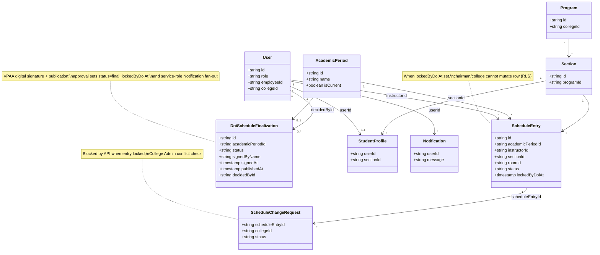

# OptiCore: Role Interfaces, Workflows, and System Architecture

This document describes the primary user interfaces and typical workflows for each stakeholder role in the **OptiCore: Campus Intelligence System (CTU Argao)**. It also summarizes the centralized hub model, the DOI/VPAA final approval flow with digital signature, and the supporting data structures.

---

## Role interfaces: sidebar navigation (each item explained)

The descriptions below follow the **left sidebar labels** in each role’s shell (`CampusIntelligenceShell` for hub roles, `PortalShell` for faculty and students). Where the **INS Form** appears, the sidebar opens **Program by Teacher** (`…/ins/faculty`); **Section** and **Room** INS layouts are reached via **in-page tabs** on that INS screen (same route family: `…/ins/section`, `…/ins/room`).

### Chairman Admin

**Shell:** Campus Intelligence (red gradient header, orange sidebar accents). Semester context is shown in the shell when configured.

| Sidebar label | Route | Purpose |
|---------------|-------|---------|
| Campus Intelligence | `/chairman/dashboard` | Landing dashboard: workload summaries, quick links, and orientation to the chairman’s scheduling scope. |
| INS Form (Schedule View) | `/chairman/ins/faculty` | Official INS **Program by Teacher** grid; use tabs on the page for **INS Section** and **INS Room** views. Live data when a college (and program, if restricted) is in scope. |
| Evaluator | `/chairman/evaluator` | Central Hub timetabling: plot or edit **ScheduleEntry** rows, run conflict checks, and align offerings to the repository. |
| Inbox | `/chairman/inbox` | Workflow messages (forwarding drafts, coordination with college/CAS/DOI as implemented). |
| Faculty Profile | `/chairman/faculty-profile` | Maintain faculty roster and **Employee ID** for linkage to plotted schedules and future instructor self-registration. |
| Subject Codes | `/chairman/subject-codes` | Browse and manage subject catalog entries relevant to the chairman’s scope. |
| Campus navigation | `/campus-navigation` | Physical campus wayfinding and map-style navigation. |

---

### College Admin

**Shell:** Campus Intelligence (college-scoped hub; filters may apply in page content).

| Sidebar label | Route | Purpose |
|---------------|-------|---------|
| Campus Intelligence | `/admin/college` | College admin dashboard and workflow orientation. |
| INS Form (Schedule View) | `/admin/college/ins/faculty` | INS views (Faculty / Section / Room via tabs) for review; live schedule data for the college in scope. |
| Central Hub Evaluator | `/admin/college/evaluator` | Read/review the same evaluator context as the hub (scope-limited in production). |
| Inbox | `/admin/college/inbox` | Inbound workflow items (e.g., forwarded schedules, cross-role messages). |
| Schedule change requests | `/admin/college/schedule-change-requests` | Queue of instructor requests: run conflict checker, approve, reject, or approve with mitigation; notifies faculty. |
| Access requests | `/admin/college/access-requests` | Approve or reject access scopes (e.g., GEC/CAS-related requests) per institutional rules. |
| Audit log | `/admin/college/audit-log` | Recent auditable actions for accountability. |
| Faculty Profile | `/admin/college/faculty-profile` | Faculty roster and profile data at college scope. |
| Subject Codes | `/admin/college/subject-codes` | Subject catalog maintenance for the college context. |
| Campus navigation | `/campus-navigation` | Physical campus navigation. |

---

### CAS Admin

**Shell:** Campus Intelligence (CAS-wide perspective).

| Sidebar label | Route | Purpose |
|---------------|-------|---------|
| Campus Intelligence | `/admin/cas` | CAS dashboard for cross-college or registry-level coordination (as configured). |
| INS Form (Schedule View) | `/admin/cas/ins/faculty` | INS Faculty view (+ Section/Room tabs); supports CAS review of plotted schedules. |
| Central Hub Evaluator | `/admin/cas/evaluator` | Evaluator access for CAS review workflows. |
| GEC distribution | `/admin/cas/distribution` | Coordinate GEC-related distribution or handoffs to GEC chair workflows. |
| Inbox | `/admin/cas/inbox` | CAS workflow inbox. |
| Audit log | `/admin/cas/audit-log` | Audit trail for CAS actions. |
| Faculty Profile | `/admin/cas/faculty-profile` | Faculty records visible to CAS scope. |
| Subject Codes | `/admin/cas/subject-codes` | Subject catalog at CAS scope. |
| Campus navigation | `/campus-navigation` | Physical campus navigation. |

---

### GEC Chairman

**Shell:** Campus Intelligence (GEC-focused module).

| Sidebar label | Route | Purpose |
|---------------|-------|---------|
| Dashboard | `/admin/gec` | GEC chairman home: entry points to vacant slots and access flows. |
| Request access | `/admin/gec/request-access` | Request elevated or scoped access when required to perform GEC duties. |
| Vacant GEC slots | `/admin/gec/vacant-slots` | Identify and fill vacant GEC offerings for the term. |
| Inbox | `/admin/gec/inbox` | Messages with CAS/College regarding GEC assignments and returns. |
| Campus navigation | `/campus-navigation` | Physical campus navigation. |

---

### DOI Admin (VPAA)

**Shell:** Campus Intelligence (institutional quality assurance).

| Sidebar label | Route | Purpose |
|---------------|-------|---------|
| Campus Intelligence | `/doi/dashboard` | DOI/VPAA dashboard: policy and schedule oversight entry points. |
| INS Form (Schedule View) | `/doi/ins/faculty` | **Program by Teacher** INS view for **all colleges**; embeds **formal approval** (campus-wide conflict check for room/faculty/section, digital signature, approve/reject, publish/lock). Section/Room INS via **in-page tabs** (`/doi/ins/section`, `/doi/ins/room`). Legacy `/doi/schedule-hub` redirects here. |
| Central Hub Evaluator | `/doi/evaluator` | Campus-wide read of evaluator/timetable context for oversight. |
| Policy reviews | `/doi/reviews` | Load-policy and related review surfaces (VPAA). |
| Inbox | `/doi/inbox` | DOI workflow inbox. |
| Audit log | `/doi/audit-log` | Audit trail for DOI-scoped actions. |
| Faculty Profile | `/doi/faculty-profile` | Oversight-oriented faculty listing (scope as implemented). |
| Subject Codes | `/doi/subject-codes` | Subject catalog oversight. |
| Campus navigation | `/campus-navigation` | Physical campus navigation. |

---

### Instructor (Faculty portal)

**Shell:** `PortalShell` (faculty badge; sidebar list below).

| Sidebar label | Route | Purpose |
|---------------|-------|---------|
| Dashboard | `/faculty` | Personal dashboard: weekly load summary, next classes, roster shortcuts, links to INS and schedule. |
| INS Form (by faculty) | `/faculty/ins/faculty` | **Your** teaching grid (INS 5A) for the college in scope; **INS Section** and **INS Room** appear as additional faculty routes when present in the local nav (`/faculty/ins/section`, `/faculty/ins/room`). |
| My schedule | `/faculty/schedule` | List or table view of **ScheduleEntry** rows assigned to the instructor for the current term. |
| Request change | `/faculty/request-change` | Submit a **schedule change request** tied to an existing plotted class; College Admin reviews. |
| Announcements | `/faculty/announcements` | Institutional or college announcements. |
| Campus navigation | `/campus-navigation` | Physical campus navigation. |

---

### Student

**Shell:** `PortalShell` (student badge).

| Sidebar label | Route | Purpose |
|---------------|-------|---------|
| Dashboard | `/student` | Student home: upcoming classes, notifications, and links to schedule and announcements. |
| My schedule | `/student/schedule` | Section-based weekly schedule derived from published **ScheduleEntry** data for the student’s section. |
| Announcements | `/student/announcements` | Announcements relevant to students. |
| Campus navigation | `/campus-navigation` | Physical campus navigation. |

---

## Use case diagram (flow)

The diagram below is a **text-renderable** view of the main use cases and how actors relate to the **OptiCore** boundary. UML **«include»** means the base use case always brings in the included behavior; **«extend»** is conditional. For full actor lists and UC IDs, see `docs/USE_CASE_DIAGRAM_GUIDE.md`.

```mermaid
flowchart TB
  subgraph actors["Actors — outside system"]
    CH[Chairman Admin]
    COL[College Admin]
    CAS[CAS Admin]
    GEC[GEC Chairman]
    DOI[DOI Admin / VPAA]
    INS[Instructor]
    STU[Student]
  end

  subgraph sys["System boundary: OptiCore + Supabase"]
    UC_AUTH[Authenticate]
    UC_EVAL[Plot & manage ScheduleEntry\nCentral Hub Evaluator]
    UC_INS[View INS Faculty / Section / Room]
    UC_CONF[Run conflict check\nscoped or campus-wide]
    UC_JUST[Submit load-policy justification\nScheduleLoadJustification]
    UC_INBOX[Send / receive workflow\nWorkflowInboxMessage]
    UC_ACC[Approve or reject AccessRequest\nGEC/CAS scopes]
    UC_SCHG[Review ScheduleChangeRequest\napprove / reject / mitigate]
    UC_VPAA[VPAA formal approval\nDoiScheduleFinalization:\ncampus conflict scan, digital signature,\npublish term → final + lock]
    UC_NOTIF[Receive Notification]
    UC_GEC[Fill vacant GEC slots\nscoped edit + access]
    UC_PORT[View portal schedule\nfaculty / student INS]
  end

  CH --> UC_AUTH
  COL --> UC_AUTH
  CAS --> UC_AUTH
  GEC --> UC_AUTH
  DOI --> UC_AUTH
  INS --> UC_AUTH
  STU --> UC_AUTH

  CH --> UC_EVAL
  CH --> UC_INS
  CH --> UC_CONF
  CH --> UC_JUST
  CH --> UC_INBOX

  COL --> UC_INS
  COL --> UC_INBOX
  COL --> UC_ACC
  COL --> UC_SCHG

  CAS --> UC_INS
  CAS --> UC_INBOX

  GEC --> UC_INS
  GEC --> UC_GEC
  GEC -.->|«extend» when scope needed| UC_ACC

  DOI --> UC_INS
  DOI --> UC_CONF
  DOI --> UC_VPAA
  DOI --> UC_JUST
  DOI --> UC_INBOX

  INS --> UC_INS
  INS --> UC_SCHG
  INS --> UC_PORT

  STU --> UC_PORT

  UC_EVAL -.->|«include»| UC_CONF
  UC_VPAA -.->|«include»| UC_CONF
  UC_SCHG -.->|«include» conflict analysis| UC_CONF
  UC_VPAA -->|notifies stakeholders| UC_NOTIF
  INS --> UC_NOTIF
  STU --> UC_NOTIF
  COL --> UC_NOTIF
  CH --> UC_NOTIF
  CAS --> UC_NOTIF
  GEC --> UC_NOTIF
```

**Reading the flow:** **Chairman** authors **`ScheduleEntry`** and optional **justifications**, then coordinates via **Inbox**. **College Admin** may **approve schedule-change requests** from faculty (with conflict checks) until the term is **VPAA-locked**. **DOI/VPAA** runs a **campus-wide** conflict scan on the **INS** path, records **digital signature** in **`DoiScheduleFinalization`**, and **publishes** the term (**`final` + `lockedByDoiAt`**), which **blocks** further chairman/college edits and triggers **notifications** to instructors, college leadership, CAS, GEC, and students. **Instructor** and **Student** primarily **consume** published schedules through **INS** and portal routes.

---

## Database schema: DOI approval and publication

The following structures support VPAA-level decisions. **Migrations** (apply in order on Supabase): `20260411120000_scheduleentry_rls_and_doi_finalization.sql`, `20260411200000_doi_schedule_published_at.sql`, `20260412120000_scheduleentry_locked_by_doi.sql`. The consolidated reference DDL is in `supabase/schema.sql`.

| Artifact | Purpose |
|----------|---------|
| `DoiScheduleFinalization` | One row per `AcademicPeriod`: `status` (pending / approved / rejected), `signedByName`, `signedAt`, `signedAcknowledged`, `publishedAt` (go-live), `decidedById`, `decidedAt`, `notes`. |
| `ScheduleEntry.status` | Set to `final` when DOI approves, indicating a published master timetable row for that term. |
| `ScheduleEntry.lockedByDoiAt` | Timestamp set (with `status = final`) when VPAA publishes; **RLS** blocks **chairman** insert/update/delete and **college admin** update on locked rows while still allowing **SELECT** so INS views show the final grid. |
| RLS | `doi_admin` may `SELECT` all schedule rows and `UPDATE` for finalization/lock; chairman policies are split (select vs insert/update/delete) with `lockedByDoiAt IS NULL` required for mutations; college admin may `SELECT`/`UPDATE` in-college rows only when not locked; `DoiScheduleFinalization` is readable/writable only by `doi_admin`. |

After approval, **Notification** rows are inserted via the **service role** for **instructors** in the term, **chairman_admin** / **college_admin** in affected colleges, **cas_admin**, **gec_chairman**, and **students** (via `StudentProfile` rows whose `sectionId` appears in that term’s plot), with role-appropriate INS portal paths in the message body.

---

## Class / domain diagram (Mermaid)

The diagram below highlights entities involved in the **centralized hub**, **schedule change** path, and **DOI final approval** (signature + publication).

### Narrative

The **centralized hub** model concentrates operational objects—**ScheduleEntry** rows keyed by **AcademicPeriod**, **Section**, **Room**, and **User** (instructor)—so that Chairman, College Admin, CAS, GEC, and DOI roles can share the same underlying timetable. **WorkflowInboxMessage** and **Notification** (not drawn above for brevity) provide cross-role handoffs.

**Instructor schedule changes** reference a concrete **ScheduleEntry**; **College Admin** runs automated conflict detection and may approve with or without mitigation, updating the row and notifying the instructor. Once **VPAA has published** that term (`lockedByDoiAt` set), the API **rejects** further schedule-change approvals that would mutate the locked row.

**DOI final approval** operates at **term** scope: **DoiScheduleFinalization** records the VPAA decision, signature metadata, and **publishedAt**. Successful approval (via the **service role**) sets **ScheduleEntry** rows for that **`academicPeriodId`** to **`status = final`**, **`lockedByDoiAt`**, and fans out **Notification** records to instructors, college and chairman admins, CAS and GEC leadership, and students whose **StudentProfile.sectionId** matches a section in that term’s plot.

---

*Document version aligns with OptiCore web application and Supabase migrations as of VPAA publication lock (`ScheduleEntry.lockedByDoiAt`) and expanded stakeholder notifications.*
