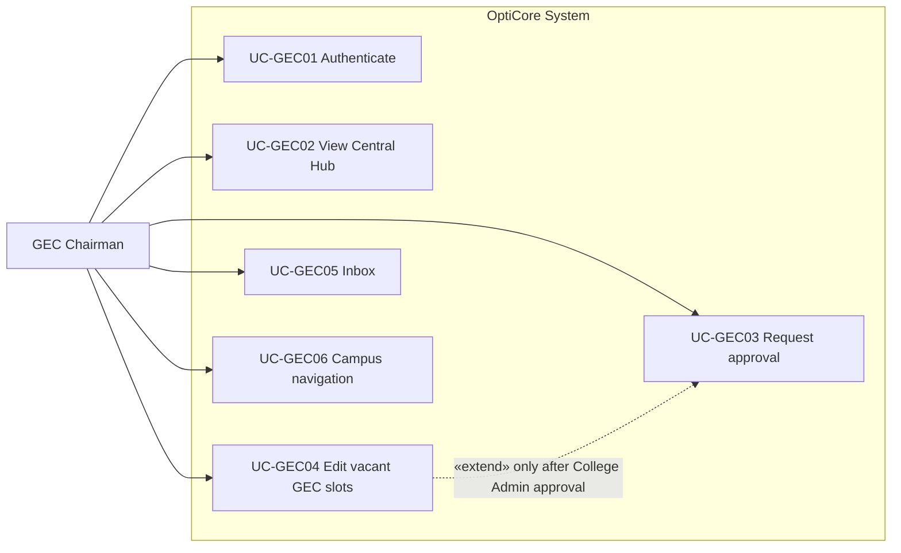
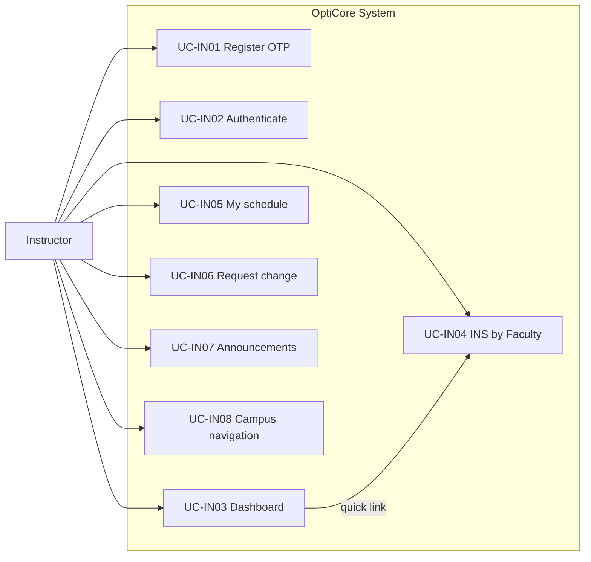
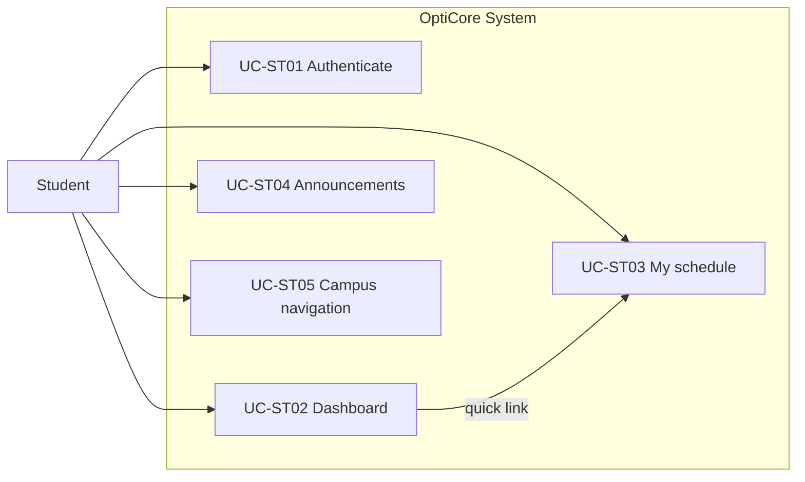

# OptiCore — Use Case Diagrams by Actor (Updated Flow)

This document provides **one use case bundle per actor**: a **numbered use case list** (ID, name, route, purpose) and a **Mermaid diagram** you can paste into [Mermaid Live](https://mermaid.live), Notion, or thesis appendices. The **system boundary** is **OptiCore** (Campus Intelligence + Supabase).

**Actors covered:** **Chairman Admin**, **College Admin**, **GEC Chairman**, **DOI Admin (VPAA)**, **Instructor**, **Student**.

**Single source of truth flow (summary):** Chairman plots → conflict check → forwards to College via Inbox → GEC requests approval → (after approval) edits vacant GEC slots → forwarded to DOI → DOI campus-wide check + signature → publish + lock → notifications.

---

## Legend

| Stereotype | Meaning |
|------------|---------|
| **«include»** | The base use case always invokes the included behavior. |
| **«extend»** | Optional behavior under a condition or gate (e.g. approval required; locked schedule blocks edits). |

---

## 1. Chairman Admin

**Shell:** `CampusIntelligenceShell` — routes under `/chairman/*`.

| ID | Use case | Primary route | Description |
|----|----------|---------------|-------------|
| UC-CH01 | Authenticate | *(session)* | Sign in; RLS scopes to college and optional program. |
| UC-CH02 | Plot schedules in Evaluator | `/chairman/evaluator` | Create/update **ScheduleEntry** for the program. |
| UC-CH03 | Run conflict check (scoped) | *(Evaluator / client)* | Detect faculty, room, and section overlaps before handoff. |
| UC-CH04 | View INS Form | `/chairman/ins/faculty` (+ section/room tabs) | Validate schedule presentation in INS format. |
| UC-CH05 | Forward INS + Evaluator to College Admin via Inbox | `/chairman/inbox` | Sends workflow message (links/refs). Schedule data remains centralized in **ScheduleEntry**. |
| UC-CH06 | Submit load policy justification | *(evaluator save path)* | Persist **ScheduleLoadJustification** for DOI review when needed. |
| UC-CH07 | Manage faculty roster / subject codes | `/chairman/faculty-profile`, `/chairman/subject-codes` | Data maintenance. |
| UC-CH08 | Use campus navigation | `/campus-navigation` | Wayfinding. |

**«include» / «extend» for Chairman**
- **UC-CH02 Plot schedules** **«include»** **UC-CH03 Run conflict check**.
- **UC-CH05 Forward to College Admin** **«include»** **UC-CH03 Run conflict check** (handoff assumes conflict-free / acceptable result).

```mermaid
flowchart LR
  CH[Chairman Admin]

  subgraph OptiCore["OptiCore System"]
    CH01[UC-CH01 Authenticate]
    CH02[UC-CH02 Plot schedules (Evaluator)]
    CH03[UC-CH03 Run conflict check]
    CH04[UC-CH04 View INS Form]
    CH05[UC-CH05 Forward via Inbox]
    CH06[UC-CH06 Load justification]
    CH07[UC-CH07 Faculty/Subjects]
    CH08[UC-CH08 Campus navigation]
  end

  CH --> CH01
  CH --> CH02
  CH --> CH03
  CH --> CH04
  CH --> CH05
  CH --> CH06
  CH --> CH07
  CH --> CH08

  CH02 -.->|«include»| CH03
  CH05 -.->|«include»| CH03
```

---

## 2. College Admin

**Shell:** `CampusIntelligenceShell` — routes under `/admin/college/*`. **Scope:** own college only (no other college’s hub data without an approved access path).

| ID | Use case | Primary route | Description |
|----|----------|---------------|-------------|
| UC-CA01 | Authenticate | *(session)* | College-scoped session. |
| UC-CA02 | Receive draft via Inbox | `/admin/college/inbox` | Receives chairman’s forward; downloads evaluator/INS references if required. |
| UC-CA03 | Centralize + review in Central Hub Evaluator | `/admin/college/evaluator` | Validates that the schedule is reflected in the hub (authoritative rows are in **ScheduleEntry**). |
| UC-CA04 | View INS Form (college scope) | `/admin/college/ins/faculty` | Review in INS format. |
| UC-CA05 | Review GEC approval request | `/admin/college/access-requests` | Receives GEC request for vacant-slot editing (scoped). |
| UC-CA06 | Run conflict check for proposed GEC insertion | *(hub/validation)* | Optional validation step before approval/rejection. |
| UC-CA07 | Approve or reject GEC request | `/admin/college/access-requests` | Gate that enables GEC vacant-slot editing. |
| UC-CA08 | Forward schedule to DOI Admin | `/admin/college/inbox` | After GEC insertion, forwards to DOI for finalization. |
| UC-CA09 | Review schedule change requests | `/admin/college/schedule-change-requests` | Instructor requests (blocked if VPAA-locked). |
| UC-CA10 | Audit log / maintenance / navigation | `/admin/college/audit-log` (+ profile/subjects), `/campus-navigation` | Accountability and supporting pages. |

**«include» / «extend» for College Admin**
- **UC-CA07 Approve or reject GEC request** **«include»** **UC-CA06 Conflict check** when validating the proposed slot changes.
- **UC-CA09 Schedule change requests** **«extend»** *(blocked)* once VPAA publishes and locks (`lockedByDoiAt` set).

```mermaid
flowchart LR
  CA[College Admin]

  subgraph OptiCore["OptiCore System"]
    CA01[UC-CA01 Authenticate]
    CA02[UC-CA02 Inbox: receive draft]
    CA03[UC-CA03 Central Hub review]
    CA04[UC-CA04 View INS Form]
    CA05[UC-CA05 Review GEC request]
    CA06[UC-CA06 Conflict check (optional)]
    CA07[UC-CA07 Approve / reject GEC]
    CA08[UC-CA08 Forward to DOI]
    CA09[UC-CA09 Schedule change requests]
    CA10[UC-CA10 Audit/Maintenance/Navigation]
  end

  CA --> CA01
  CA --> CA02
  CA --> CA03
  CA --> CA04
  CA --> CA05
  CA --> CA06
  CA --> CA07
  CA --> CA08
  CA --> CA09
  CA --> CA10

  CA07 -.->|«include»| CA06
```

---

## 3. GEC Chairman

**Shell:** `CampusIntelligenceShell` — routes under `/admin/gec/*`. **Scope:** view hub schedules; edit only vacant slots for **GEC subjects** after College Admin approval.

| ID | Use case | Primary route | Description |
|----|----------|---------------|-------------|
| UC-GEC01 | Authenticate | *(session)* | Sign in; role is `gec_chairman`. |
| UC-GEC02 | View Central Hub schedules | *(Central Hub)* | Views centralized schedules by selecting the respective college. |
| UC-GEC03 | Request approval for vacant slots | `/admin/gec/request-access` | Submits request approval to the **respective College Admin**. |
| UC-GEC04 | Edit vacant slots (GEC only) | `/admin/gec/vacant-slots` | Plots **GEC** subjects into **vacant** slots **only after approval**. |
| UC-GEC05 | Use Inbox | `/admin/gec/inbox` | Receives workflow communication. |
| UC-GEC06 | Use campus navigation | `/campus-navigation` | Wayfinding. |

**«include» / «extend» for GEC Chairman**
- **UC-GEC04 Edit vacant slots** **«extend»** *(blocked)* until **UC-CA07 Approve GEC request** is completed.



---

## 4. DOI Admin (VPAA)

**Shell:** `CampusIntelligenceShell` — routes under `/doi/*`.

| ID | Use case | Primary route | Description |
|----|----------|---------------|-------------|
| UC-DOI01 | Authenticate | *(session)* | Sign in; role is `doi_admin`. |
| UC-DOI02 | Receive forwarded schedule | `/doi/inbox` | Receives the schedule workflow after GEC insertion. |
| UC-DOI03 | Campus-wide conflict check (INS view) | `/doi/ins/faculty` | Full-campus scan of room/faculty/section conflicts for the selected term. |
| UC-DOI04 | Review load justifications | `/doi/reviews` | Reviews **ScheduleLoadJustification** rows submitted by chairmen. |
| UC-DOI05 | Approve/reject with digital signature | `/doi/ins/faculty` | Records decision in **DoiScheduleFinalization** with signature metadata. |
| UC-DOI06 | Publish and lock schedules | *(on approve)* | Sets **ScheduleEntry** to **final** and **lockedByDoiAt** (no more editing). |
| UC-DOI07 | Send notifications | *(on publish)* | Notifies all relevant users once published. |
| UC-DOI08 | Use campus navigation | `/campus-navigation` | Wayfinding. |

**«include» / «extend» for DOI Admin**
- **UC-DOI05 Approve** **«include»** **UC-DOI03 Campus-wide conflict check**.
- **UC-DOI06 Publish and lock** **«include»** **UC-DOI07 Send notifications**.

```mermaid
flowchart LR
  DOI[DOI Admin / VPAA]

  subgraph OptiCore["OptiCore System"]
    D01[UC-DOI01 Authenticate]
    D02[UC-DOI02 Inbox: receive forward]
    D03[UC-DOI03 Campus-wide conflict check]
    D04[UC-DOI04 Review justifications]
    D05[UC-DOI05 Approve / reject (signature)]
    D06[UC-DOI06 Publish + lock]
    D07[UC-DOI07 Notifications]
    D08[UC-DOI08 Campus navigation]
  end

  DOI --> D01
  DOI --> D02
  DOI --> D03
  DOI --> D04
  DOI --> D05
  DOI --> D08

  D05 -.->|«include»| D03
  D06 -.->|«include»| D07
  D05 -->|on approve| D06
```

---

## 5. Instructor

**Shell:** `PortalShell` (faculty badge) — routes under `/faculty/*`.

| ID | Use case | Primary route | Description |
|----|----------|---------------|-------------|
| UC-IN01 | Register (self-service) | `/register/instructor` | Gmail + OTP; first-time password setup as implemented. |
| UC-IN02 | Authenticate | `/login` | Faculty portal session. |
| UC-IN03 | View dashboard | `/faculty` | Welcome, upcoming classes, notifications, links to INS and tools. |
| UC-IN04 | View INS Form by Faculty | `/faculty/ins/faculty` | Official teaching grid (INS 5A) scoped to the instructor. |
| UC-IN05 | View My schedule | `/faculty/schedule` | Tabular/list view of **ScheduleEntry** for current term. |
| UC-IN06 | Request schedule change | `/faculty/request-change` | Submit **ScheduleChangeRequest** for College Admin review; blocked if VPAA-locked. |
| UC-IN07 | View announcements | `/faculty/announcements` | Notices relevant to faculty. |
| UC-IN08 | Use campus navigation | `/campus-navigation` | Wayfinding. |

**«extend» for Instructor**
- **UC-IN06 Request schedule change** **«extend»** *(blocked)* once VPAA publishes and locks (`lockedByDoiAt` set).



---

## 6. Student

**Shell:** `PortalShell` (student badge) — routes under `/student/*`.

| ID | Use case | Primary route | Description |
|----|----------|---------------|-------------|
| UC-ST01 | Authenticate | `/login` | Student portal session. |
| UC-ST02 | View dashboard | `/student` | Welcome, upcoming classes, notifications, links. |
| UC-ST03 | View My schedule (INS by Section) | `/student/schedule` | Official weekly grid for the student’s section from **ScheduleEntry**. |
| UC-ST04 | View announcements | `/student/announcements` | Notices; mark as read. |
| UC-ST05 | Use campus navigation | `/campus-navigation` | Wayfinding. |



---

## Cross-actor relationships (reference)

| From | To | Relationship | Notes |
|------|-----|--------------|--------|
| UC-CH05 | UC-CA02 | **«include»** (workflow) | Chairman forwards INS + Evaluator context → College Inbox. |
| UC-CA07 | UC-GEC04 | **«extend»** gate | GEC edits vacant slots only **after** College Admin approval. |
| UC-CA08 | UC-DOI02 | **«include»** (workflow) | After GEC insertion, College forwards schedule → DOI Inbox. |
| UC-DOI05 | UC-DOI06 | **«include»** publish | DOI approval triggers publish + lock. |
| UC-DOI06 | UC-CH02, UC-CA03, UC-IN06 | **«extend»** guard | **lockedByDoiAt** blocks editing/approvals; views remain readable. |

---

*Aligned with the official updated flow and the project’s role routes in `docs/ROLE_UIFLOWS_AND_ARCHITECTURE.md`.*
